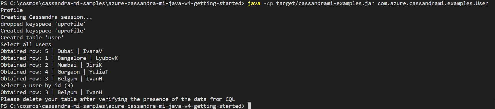

# Developing a Java app using Azure Managed Instance for Apache Cassandra (v4.x Driver).
Azure Managed Instance for Apache Cassandra provides automated deployment and scaling operations for managed open-source Apache Cassandra datacenters. It accelerates hybrid scenarios and reduces ongoing maintenance.

This quick start demonstrates how to connect to a Cassandra Managed instance cluster. You'll then build a user profile console app, output as shown in the following image, with sample data.

## Prerequisites
* Before you can run this sample, you must have the following prerequisites:
    * An Azure Managed Instance for Apache Cassandra cluster. Check out our Quickstart guide [here](https://docs.microsoft.com/azure/managed-instance-apache-cassandra/create-cluster-portal).
    * Networking access from this application to your Azure Managed Instance for Apache Cassandra cluster (the service only deploys private IP addresses injected into a Virtual network).
    * [Java Development Kit (JDK) 1.8+](http://www.oracle.com/technetwork/java/javase/downloads/jdk8-downloads-2133151.html)
        * On Ubuntu, run `apt-get install default-jdk` to install the JDK.
    * Be sure to set the JAVA_HOME environment variable to point to the folder where the JDK is installed.
    * [Download](http://maven.apache.org/download.cgi) and [install](http://maven.apache.org/install.html) a [Maven](http://maven.apache.org/) binary archive
        * On Ubuntu, you can run `apt-get install maven` to install Maven.
    * [Git](https://www.git-scm.com/)
        * On Ubuntu, you can run `sudo apt-get install git` to install Git.

## Running this sample
1. Clone this repository using `git clone https://github.com/Azure-Samples/azure-cassandra-mi-java-v4-getting-started`.

3. Update parameters in `src/main/resources/application.conf`: 
    1. Enter the datacenter name in the `DC` field.
    1. Enter `username` and `password` in `datastax-java-driver.advanced.auth-provider` section, and the IP addresses of your cluster seed nodes in `datastax-java-driver.basic.contact-points`.

5. Run `mvn clean package` from the top level folder to build the project. This will generate `cassandrami-examples.jar` under target folder.
 
6. Run `java -cp target/cassandrami-examples.jar com.azure.cassandrami.examples.UserProfile` in a terminal to start your java application.
   

## About the code
The code included in this sample is intended to get you quickly started with a Java command line application that connects to Azure Managed Instance for Apache Cassandra.

